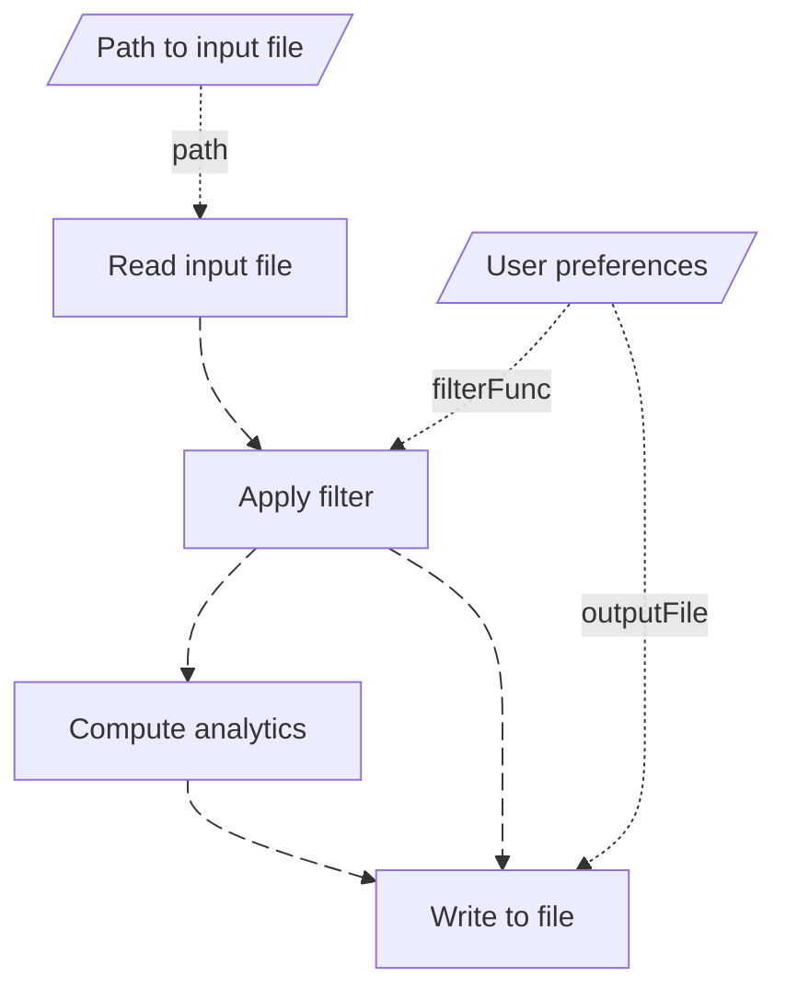
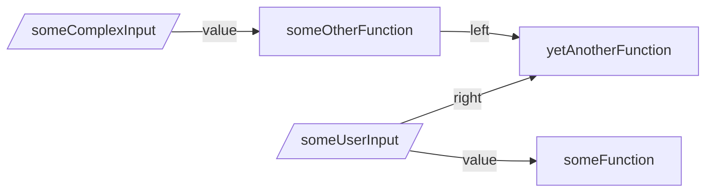

I'm currently working with TypeScript on a couple of projects, and I'm enjoying it quite a bit. The ability to express constraints and guide users via the type system is really one of a kind, mostly because said type system is actually [Turing complete](https://github.com/microsoft/TypeScript/issues/14833).

In this post, I'll use the example of a simple [DAG](https://en.wikipedia.org/wiki/Directed_acyclic_graph) library to show how users can be guided into doing the right thing, without the need for building additional tooling. This is something I already contributed to building in Python, using all of the metaprogramming capabilities of the language, so it will be an interesting thing to explore!

```note
  If you want to look at the code while reading, you can refer to the [Github repository](https://github.com/maxime-filippini/dag-ts).
```

## Types, type systems and type safety

A **type** is a property of an object within our code that describes its shape and what can be done with that object. If you've ever done any kind of programming, you're probably familiar with what we call "primitive types", like strings, booleans, integers, but types can be quite a bit more complicated, when collections are involved (like lists, dictionaries, sets, etc.).

Every programming language has types, and how those types are surfaced to the developers depends on whether the language is **dynamically typed**, or **statically typed**.

Dynamically typed languages, like Python and Javascript, only make use types when the code is executed, and if a type mismatch occurs at that time, an error will be raised to the user. Consider this Python code:

```python
x = 50
print(x.upper())
```

**This is valid Python code that we can run**, but when the second line runs, we will be greeted by the following exception

```pytb
Traceback (most recent call last):
  File "/path/to/file.py", line 2, in <module>
    print(x.upper())
          ^^^^^^^
AttributeError: 'int' object has no attribute 'upper'
```

Wouldn't it be nice if we could have a tool that would let us know that calling `.upper` on `x` will lead to an error? 

That's exactly what tools like [`mypy`](https://mypy-lang.org/) and [`pyright`](https://microsoft.github.io/pyright/#/) do for Python. These tools can be used either via their command-line interfaces ("CLI"), or directly in your code editor, leveraging the [Language Server Protocol](https://microsoft.github.io/language-server-protocol/) ("LSP").

These Python tools leverage two main mechanisms:

- [**Type hints**](https://docs.python.org/3/library/typing.html), which are indications of an object's type you provide in your code;
- **Type inference**, when no type hints are provided.

Then, we can get error messages like this in our editor:

```python lint="3 4"
x = 50
print(x.upper())
        ^^^^^
        Cannot access attribute "upper" for class "Literal[50]"
```

For Javascript, the most popular tool used to bring in type checking to the language is called **TypeScript**. TypeScript is a superset of Javascript that supports type definitions and comes with a [compiler](https://www.typescriptlang.org/docs/handbook/compiler-options.html) for checking the compatibility of types within our code. Just like the Python typing tools, the TypeScript compiler is accessible via a language server.

When a program has been **strictly** checked for type compatibility before it is run, we say that the program is "**type safe**".

```note
  Because Javascript and Python are dynamic languages, their type checkers are built to be able to be used "loosely", as they provide an `any` type. Typing something as `any` effectively means we are opting out of type checking for that variable and its dependents.

  However, these tools can be configured to disallow this looseness, **which is the only way type safety can possibly be guaranteed.**
```

For example, the following program cannot be considered type-safe, since the user can pass in anything to the function:

## Differences in the usage of types in TypeScript and Python

While TypeScript is considered a programming language, **it is not one you can execute as is**. Instead, it needs to be [transpiled](https://en.wikipedia.org/wiki/Source-to-source_compiler) to Javascript, so it can be run by a [Javascript runtime](https://www.freecodecamp.org/news/javascript-engine-and-runtime-explained/).

This means that by the time your code gets executed, all of the type information is gone! As such, we cannot possibly use these types to provide metadata to our code and guide the way it will be run.

This is however allowed in Python, and has been leveraged to great effect by libraries like Pydantic and FastAPI to provide a great developer experience.

Here is an example of how we can extract metadata stored on a variable's type hint:

```python
from dataclasses import dataclass
from typing import Annotated, get_args

# Define some kind of class for holding metadata
@dataclass
class Metadata:
    description: str

# Add metadata at the type level
some_value: Annotated[int, Metadata(description="This is very important")] = 42

# Extract the type and metadata via `__annotations__`
tp, metadata = get_args(__annotations__["some_value"])

print(tp) # -> int
print(metadata) # -> Metadata(description='This is very important')
```

This can be used for example to build a [dependency injection](https://en.wikipedia.org/wiki/Dependency_injection) system, with the type information providing the source of a dependency (see a code example [here](https://gist.github.com/maxime-filippini/7a00128fd55695385c94fd62b2964644)).

In the rest of this post, we'll see how we can build a TypeScript library for defining and executing Directed Acyclic Graphs ("DAG") in a type-safe way.

## Project overview

Imagine you want to provide a system to your user that allows them to build "workflows" (think something like [n8n](https://n8n.io/)) using code, and have these workflows be self-documenting and benefit from a standardized execution environment, providing detailed execution reports.

A workflow takes the form of a DAG, where each node is a user-defined function. Here is a representation of such a workflow, with data shown as parallelograms and operations as rectangles:



Each node in the workflow performs an operation, and in general, will depend on either a piece of data, or the result of a prior calculation. This dependency can be specified as a kind of "contract", which can be defined at the type level.

For example, depending on its implementation, the `Apply filter` step of our graph may need the output of `Read input file` to be an array of objects, with each object containing a certain field, which will be part of the filter.

In addition, because the user will be able to pass in data to the graph (e.g. like `User preferences`), we will need some form of **runtime validation** for that data. Luckily, the [`zod`](https://zod.dev/) library also provides TypeScript type inference in addition to the runtime validation component, making it a great fit for our use case.


### Providing type safety

This project will be a **library** that allows user to build and execute DAGs in a type-safe manner, in order to maximize our developer experience.

Take a DAG with no node or requirement. What if we could express the type of this DAG as just that: `DAG with no node or requirements`?

Then, if we add a requirement named `count`, of type `number`, what if that type could become: `DAG with no node and requirements of shape {count: number}`?

Then, when it comes time to add a node to this DAG, the type system can indicate to the user that the `count` requirement is available for this node to use, and using any other ID will lead to a TypeScript error.

**This is exactly what TypeScript allows us to do**, and thanks to the associated language server, these errors will be displayed to users directly in their editor, as they write the erroneous code.

To make the building of our DAG type-safe, we will need to keep track of the nodes and requirements we add to it, as we do it. For that, we will make use of the [Fluent Interface](https://en.wikipedia.org/wiki/Fluent_interface) pattern.

Here is what our API will look like.

```ts
// Import the Dag class from our library
import { Dag } from "./lib";

// To define a DAG, we start by providing metadata, then add 
// requirements and nodes
let exampleDag = new Dag({ id: "myFirstDag" })
  .addRequirement(<id>, <schema>)
  //              │     └─ zod schema used for runtime validation
  //              └─ Requirement identifier
  .addNode(<id>, <func>, <sources>)
  //       │     │       └─ Sources for the function's arguments.
  //       │     │          Takes the form: {<argField>: <nodeId>, ...}
  //       │     └─ The function associated with the node. Takes in a
  //       │        single object as argument.
  //       └─ Node identifier    

// Executing a DAG requires the user to provide values for the 
// requirements set on said DAG.
let result = dag.execute({<id>: <value>, ...});
//                        │     └─ Value for the requirement
//                        └─ Requirement identifier
```

Let's see what type safety brings us by considering what can go wrong when a user defines a DAG. For instance:

- They may define a node whose function will take an argument that doesn't exist on the DAG (either due to a typo or a genuine error).
- They may refer to an existing node on the DAG but whose type is incompatible.

We show what would happen in both of these situations in the code samples below.

#### Non-existing node/requirement

```ts lint="11 12 13"
let dag = new Dag({ id: "myDag" })
  .addRequirement("req1", z.number())
  .addRequirement("req2", z.number())
  .addRequirement("req3", z.number())
  .addNode(
    "someFunction",
    function ({ value }) {
      return value + 1;
    },
    { value: "req4" }
      ^^^^^
      Type '"req4"' is not assignable to 
      type '"req1" | "req2" | "req3"'.
  );
```

Nice! Our code editor tells us what would have been an acceptable value, and we can easily fix it.

#### Type incompatibility

```ts lint="11 12 13"
import { Dag } from "./lib";
import { z } from "zod";

let dag = new Dag({ id: "myDag" })
  .addRequirement("req1", z.number())
  .addRequirement("req2", z.string())
  .addNode(
    "someFunction",
    function ({ value }) {
      return value.split("");
                   ^^^^^
                   Property 'split' does not exist on 
                   type 'number'.
    },
    { value: "req1" }
  );
```

Same thing! We didn't provide a type hint for `value` here, so it was inferred to be of the same type as `req1`, which is a `number`. 

What if we gave a type hint of `string` though?

```ts lint="7 8 9 10 11"
let dag2 = new Dag({ id: "myDag" })
  .addRequirement("req1", z.number())
  .addRequirement("req2", z.string())
  .addNode(
    "someFunction",
    function ({ value }: { value: string }) {
    ^^^^^^^^
    Argument of type '({ value }: { value: string; }) => string[]'
    is not assignable to parameter of type
    '(args: MappedSourceArgs<{}, { req1: number; req2: string; },
    { value: "req1"; }>) => string[]'.
      return value.split("");
    },
    { value: "req1" }
  );
```

The error message is a little bit more obtuse, but states that the signature of our function does not match the expected signature, whose argument is an object that maps the `value` field to `req1`, which is a `number`.

## Quick overview of some TypeScript concepts

The TypeScript type system is very complex, and we won't be using most of the features it provides here. However, there are two concepts that need to be understood before we carry on.

1. How to build types from other types; and
1. What "generics" are and how they can be used.

Let's start with the easier concept first.

### Building types from other types

#### Infer from zod schemas

One core component of our DAG is the definition of **requirements**, which have an ID and a `zod` schema provided by the user. But what is the "type" that the requirement will take in our DAG? Where is that type defined?

For example, say we require the user to pass in a `number` greater than 10 by specifying `z.number().min(11)` as the `zod` schema. How can we make the DAG aware that this requirement will have to be a number?

This is actually quite simple, since the schema embeds the type and adds some constraints to it. All we need to do is **infer** the type from the schema, as such:

```ts
import { z } from "zod";

const schema = z.object({
  a: z.string().min(1),
  b: z.number().min(11),
});

// This is the type of the schema itself

// z.ZodObject<{
//     a: z.ZodString;
//     b: z.ZodNumber;
// }, z.core.$strip>

// Let zod infer from the type of `schema`
type TSchema = z.infer<typeof schema> 

// This is the inferred type:
type TSchema = {
    a: string;
    b: number;
}
```

Perfect, no repetition needed for us to get our type.

#### Add keys to object

When our DAG is first created, it has no node or requirement. When a requirement is added, we need to add `{<id>: <type>}` to a type that represents an empty object.

Let's see how to do this:

```ts
// This type represents an empty object.
type EmptyMap = {};

// This type now represents an object with a single key of "reqId", and an
// associated value of type `TSchema`.
type WithAddedKey = EmptyMap & { reqId: TSchema };

// This type now has a second key of "reqId2", with a value of type `number`
type WithAnotherKeyAdded = WithAddedKey & { reqId2: number };
```

Hovering `WithAnotherKeyAdded` shows:

```ts
type WithAnotherKeyAdded = {
    reqId: TSchema;
} & {
    reqId2: number;
}
```

Which is equivalent to:

```ts
type WithAnotherKeyAdded = {
  reqId: TSchema;
  reqId2: number;
}
```

When hovering types, the former notation can quickly become unwieldy, and the latter would be much preferred. Thankfully, we can wrap any object type into a simple utility type to get the better representation.

```ts
type WithAnotherKeyAdded = Prettify<WithAddedKey & { reqId2: number }>;

// Hovering `WithAnotherKeyAdded` shows:

// type WithAnotherKeyAdded = {
//   reqId: TSchema;
//   reqId2: number;
// }
```

For more information on `Prettify`, [read here](https://www.totaltypescript.com/concepts/the-prettify-helper), but note that it makes use of **generics**, which we tackle in the next section.

### Generics

Generics (or "generic types") often give people headaches but they're not that complicated. Conceptually, a generic type is nothing more than a **parametrized type**.

Imagine a logging function that will log the value passed to it, then return that value unchanged. Because that function has to work for any type, you may be tempted to write it as:

```ts
function logValue(value: any) {
  console.log(value);
  return value
}
```

But what happens after it is called on a value?

```ts
let v = 5;
let logged = logValue(v);

// Hovering `logged` shows:

//  any
```

**Uh oh**. We've now lost the type information after logging the value, which is silly because this function hasn't changed the value at all.

We actually wanted to express that whatever the type `value`, `logValue` will return the **same type**, not just **any type**.

This can be achieved thanks to generics, by providing a **type parameter** to our function to express this exact thing.

```ts
function logValue<T>(value: T): T {
  //              │         │  └─ The function's return type         
  //              │         └─ value is of type T, whatever it is
  //              └─ logValue has a type parameter T, which can
  //                  be anything
  console.log(value);
  return value;
}
```

Here, we have parametrized `logValue` with the type variable `T`, which is indicated as being the type of `value`. We've also added `T` as the return type for our function. 

Now, TypeScript will take the type of whatever we pass to `value`, substitute `T` with it, which will then specify the return type as being that same type.

But what if we intend to only provide `string` or `number` types to `logValue`? We would need to modify our function to indicate that `T` has to be one of those types and no other. This is done by "binding" `T` to the union type `string | number`, as so:

```ts
function logValue<T extends string | number>(value: T): T {
  console.log(value);
  return value;
}
```

```note
Simply writing `<T>` is equivalent to `<T extends any>`, i.e. `T` is a sub-type of `any`, which means `T` can be any type.
```

Generics are not only used to parametrize the type of functions, but also type definitions. Consider a type representing a variable tagged with an ID. We could write its type as a generic like so:

```ts
type Tagged<T extends any> = {
  id: string,
  value: T
}
```

Then we can use that type with the provided parameter in typed declarations, like:

```ts
let taggedValue: Tagged<number[]> = {
  id: "myValue",
  value: [1, 2, 3],
};
```

Finally, we can use generics to embed metadata into a type. Say we want to "tag" a value with an ID, and have that ID exist on the type of the tagged value, as a parameter. We can slightly modify our `Tagged` type as such:

```ts
type Tagged<TId extends string, T> = {
  id: TId;
  value: T;
};

// This function produces tagged values, and will infer the types
// for TId and T
function makeTagged<TId extends string, T>(id: TId, value: T): Tagged<TId, T> {
  return {
    id,
    value,
  };
}

let x = makeTagged("someId", {a: 5, b: "hello" })

// Hovering `x` shows:

// Tagged<"someId", {
//     a: number;
//     b: string;
// }>
```

Now, the ID applied to the value, as well as the value's type will be accessible to any type that is generic over the tagged value's type.

This is the kind of pattern we will use to add new information on our DAG type, as we show in the next section.

## Building our library

### The types we're going to need

As mentioned previously, a DAG's type will be defined based on the nodes and requirements it holds, which will change over time.

We start by defining what a node is through the following type:

```ts
type TDagNode<TId extends string = string, TReturn = any> = {
  readonly id: TId;
  readonly fn: (args: any) => TReturn;
  readonly sources: Record<string, string>;
};
```

This type is generic over two type variables, `TId` and `TReturn`. As shown in the body of the type, the former is the literal value used for the `id` attribute of the node, and the latter is the return type of the `fn` attribute. Note that we mark our attributes as `readonly` to indicate to the type system that they should be considered as [immutable](https://en.wikipedia.org/wiki/Immutable_object).

To type the whole set of nodes on the DAG, we define the `NodeMap` type below:

```ts
type NodeMap = Record<string, TDagNode>;
```

Here, the `Record<K, V>` type is a generic type representing the type of an object whose keys are of type `K` and whose values are of type `V`.

Similarly, we define the `ReqMap` type as:

```ts
type ReqMap = Record<string, any>
```

Here, we use `any` because the types of the requirements will be heterogeneous (e.g. `req1` may be a `string` and `req2` a `number`).

Finally, our DAG will be generic over the node map and the requirement map so we can modify these maps upon the addition of nodes and requirements.

As such, the definition for our `Dag` class will be:

```ts
export class Dag<
  TNodeMap extends NodeMap = {},
  TReqMap extends ReqMap = {}
> {
  // Type definition for the attributes
  public id: string;
  public nodes: TNodeMap;
  public requirements: Record<string, z.ZodType>;  

  // Equivalent to Python's `__init__`
  constructor({ id }: { id: string }) {
    this.id = id;
    this.nodes = {} as TNodeMap; // Needed because TNodeMap is generic
    this.requirements = {};
  }  
}
```

Creating a new DAG shows the following type, as expected:

```ts
let dag = new Dag({ id: "myDag" });
// Dag<{}, {}>
```

### Adding requirements

Adding a requirement to our DAG is straightforward in its implementation. Here is the code without types:

```ts
export class Dag {
  // ...

  addRequirement(id, schema) {
    this.requirements[id] = schema;
    return this;
  }
}
```

Very simple, we add a new entry to the `requirements` object on the DAG, characterized by a `zod` schema, and return the modified DAG.

Now, onto typing this method!

Remember our objective: while this method returns the DAG, we need to indicate to the type system that this DAG's requirement map now has an entry associated with the literal `id` provided to the method, whose associated type will be the one inferred from the `zod` schema.

Because we have that link between the input types and the output type, we need to make this method a generic over the type of the inputs.

```ts
export class Dag<TNodeMap extends NodeMap = {}, TReqMap extends ReqMap = {}> {
  // ...

  addRequirement<TId extends string, T extends z.ZodType>(
    id: TId,
    schema: T
  ): Dag<TNodeMap, Prettify<TReqMap & Record<TId, z.infer<T>>>> {
    this.requirements[id] = schema;
    return this as any; 
    //          ^^^^^^
    //          This is needed to let TypeScript accept that we've 
    //          changed the type, yet we're not creating a new variable.
  }
}
```

As you can see, the return type for our method is a `Dag` with a node map of type `TNodeMap`, i.e. the node map type for the current DAG since we're not changing it, and a requirement map of type `Prettify<TReqMap & Record<TId, z.infer<T>>>`.

Let's look at the type of a DAG with a couple of requirements added:

```ts
let dag = new Dag({ id: "myDag" })
  .addRequirement("someUserInput", z.number().min(42))
  .addRequirement(
    "someComplexInput",
    z.object({
      a: z.number(),
      b: z.string().min(1),
    })
  );

// Hovering `dag` shows:

// Dag<{}, {
//   someUserInput: number;
//   someComplexInput: {
//       a: number;
//       b: string;
//   };
// }>
```

Looking good! Let's now look at what we need to do when adding nodes.

### Adding nodes

The implementation logic for adding nodes to our DAG is almost as straightforward as it was for requirements. We create a node object, handle the case where no `sources` is provided, and add it to the `nodes` object held on the DAG.

```ts
export class Dag {
  // ...

  addNode(id, fn, sources?) {
    const newNode = {
      id,
      fn,
      sources: sources
        ? Object.fromEntries(
            Object.entries(sources).map(([k, v]) => [k, v as string])
            // Casting `v` to string is necessary here
          )
        : {},
    };
    this.nodes[id] = newNode;
    return this;
  }
}
```

Now, adding types to this method is a bit more tricky, as there are two situations possible, depending on whether `sources` are required. Indeed, if one decides to add a node whose function `fn` takes **no argument**, then `sources` can be omitted. For that, we're going to use [function overloading](https://www.typescriptlang.org/docs/handbook/2/functions.html#function-overloads), i.e. provide multiple type declarations for a single function!

The case where `sources` can be omitted is simpler. Here's the type definition:

```ts
export class Dag<TNodeMap extends NodeMap = {}, TReqMap extends ReqMap = {}> {
  // ...

  addNode<TName extends string, TReturn>(
    id: TName,
    fn: () => TReturn
  ): Dag<Prettify<TNodeMap & Record<TName, TDagNode<TName, TReturn>>>, TReqMap>;
}
```

The only difference between this and the `addRequirements` type is that we fully specify in our type that, for this definition, `fn` takes no argument. Then, we add `Record<TName, TDagNode<TName, TReturn>>` to the `TNodeMap` defined on the `Dag` class.

Now, let me provide you with the code needed for the case where `fn` takes an argument, and I'll explain right after.

```ts
export class Dag<TNodeMap extends NodeMap = {}, TReqMap extends ReqMap = {}> {
  // ...

  addNode<
    TName extends string,
    TArgs extends Record<string, any>,
    TReturn,
    TSources extends Record<keyof TArgs, keyof TNodeMap | keyof TReqMap>,
  >(
    id: TName,
    fn: (args: MappedSourceArgs<TNodeMap, TReqMap, TSources>) => TReturn,
    sources: TSources
  ): Dag<Prettify<TNodeMap & Record<TName, TDagNode<TName, TReturn>>>, TReqMap>;
}
```

Hopefully, the type parameters used above make sense to you:

- `TName` refers to the literal value of `id`;
- `TArgs` refers to the argument object needed by `fn`;
- `TReturn` is the return type of `fn`; and
- `TSources` refers to the object that maps the name of the arguments of `fn` to the IDs of requirements/nodes that exist on the DAG.

But why is `args` in `fn` typed as `MappedSourceArgs<TNodeMap, TReqMap, TSources>` then?

**It is used so we can check that the type of the argument attributes match those stored in `TNodeMap` and `TReqMap`.**

Here it is with comments:

```ts
type MappedSourceArgs<TNodeMap, TReqMap, TSources> = {
  [K in keyof TSources]: TSources[K] extends keyof TNodeMap
// │                      │         └─ This means we are in a
// │                      │             situation where the ID
// │                      │             refers to a node
// │                      └─ The ID of the associated 
// │                           node/requirement
// └─ The keys in TSources

    // When it's a node, extract the return type from the node type stored
    // on the node map
    ? ExtractNodeReturnType<TNodeMap[TSources[K]]>

    // Otherwise, if it is a requirement...
    : TSources[K] extends keyof TReqMap

      // ...get the type directly from the requirement map
      ? TReqMap[TSources[K]]

      // Otherwise the type is invalid
      : never;
};

// If T is a DagNode with return type R, this type will be R, 
// otherwise it will be `never` (an invalid type)
type ExtractNodeReturnType<T> = T extends TDagNode<any, infer R> ? R : never;
```

To summarize, `MappedSourceArgs` is an object type whose keys are those provided in `sources`, and the values are the types of the nodes/requirements whose IDs match the associated values in `sources`.

For example, say we have the following DAG:

```ts
let dag = new Dag({ id: "myDag" })
  .addRequirement("someUserInput", z.number().min(42))
  .addRequirement(
    "someComplexInput",
    z.object({
      a: z.number(),
      b: z.string().min(1),
    })
  )
  .addNode(
    "someFunction",
    function ({ value }) {
      return value + 1;
    },
    { value: "someUserInput" }
  )
  .addNode(
    "someOtherFunction",
    function ({ value }) {
      return value.a ** 2;
    },
    { value: "someComplexInput" }
  )
  .addNode(
    "yetAnotherFunction",
    function({ left, right }) {
      return left + right
    },
    { left: "someOtherFunction", right: "someUserInput"}
  )
```

We have that:

- In the context of the `someFunction` node, `MappedSourceArgs` is equivalent to `{value: number}`, since the `someUserInput` requirement is of type `number`, as inferred from its `zod` schema.
- In the context of the `someOtherFunction` node, `MappedSourceArgs` is equivalent to `{value: { a: number, b: string }}`, since the `someComplexInput` requirement is of type `{ a: number, b: string }`, as inferred from its `zod` schema.
- In the context of the `yetAnotherFunction` node, `MappedSourceArgs` is equivalent to `{left: number, right: number}`, since the `someUserInput` requirement is of type `number` as inferred from its `zod` schema, and the return type of the `someOtherFunction` node is `number`.

Finally, we need to annotate the actual implementation of `addNode`, with the loosest types that cover both of our overloaded type definitions, i.e.

```ts
export class Dag<TNodeMap extends NodeMap = {}, TReqMap extends ReqMap = {}> {
  // ...

  addNode<TName extends string, TArgs, TReturn, TSources>(
    id: TName,
    fn: (args?: TArgs) => TReturn,
    sources?: TSources
  ): any {
    const newNode: TDagNode<TName, TReturn> = {
      id,
      fn: fn as any,
      sources: sources
        ? Object.fromEntries(
            Object.entries(sources).map(([k, v]) => [k, v as string])
          )
        : {},
    };

    (this.nodes as any)[id] = newNode;
    return this as any;
  }
}
```

This is all the code and type declarations we need to have type safety when **building** our DAG. Let's now dig into the implementation of the execution logic.

### Execution logic

The execution of the DAG is done by way of an `execute` method. Calling it looks like this:

```ts
// `execute` is an async method to allow for async nodes
let output = await dag.execute({
  someUserInput: 42,
  someComplexInput: {
    a: 5,
    b: "AAA",
  },
});

console.log({ output });

// {
//   output: {
//     someUserInput: 42,
//     someComplexInput: {
//       a: 5,
//       b: "AAA",
//     },
//     someFunction: 43,
//     someOtherFunction: 25,
//     yetAnotherFunction: 67,
//   },
// }
```

The execution is performed in three steps:

1. First, the object passed by the user is validated against the `zod` schemas defined for the DAG's requirements.
1. Then, the nodes are [topologically sorted](https://en.wikipedia.org/wiki/Topological_sorting), i.e. sorted in such a way that each node's function can be evaluated in order, and all its dependencies will have already been computed.
1. Finally, the computations are carried out one by one.

For that code, please check out the full implementation [here](https://github.com/maxime-filippini/dag-ts/blob/develop/src/lib/index.ts#L135).

### Example of extra goodies using DAGs bring you

Because we've defined a DAG in a declarative way, we can build tools around it to help us understand the workflow better, even without executing it. For example, one very simple thing to build is a **[Mermaid](https://mermaid.js.org/) graph generator**.

By implementing a `toMermaid` method on the `Dag` class, we can generate a simple diagram representation of our graph:

```ts
let { code } =  dag.toMermaid();
console.log(code)
```



Similarly, we could expand the metadata provided to nodes to add a description and use them to implement a documentation of sorts for the workflow.

We will build upon this in a future post.


## Conclusion

By threading literal IDs, inferred Zod types, and mapped source arguments through a fluent builder, we made a DAG object whose type is a living specification of what will be valid in the next steps.

Leveraging TypeScript this way allows us to build robust libraries and avoid the need for writing extending "how to" guides, as our users are guided towards the correct way of doing things.

Of course, the library can be extended with additional functionalities such as:

- A live visualizer for our nodes and their metadata;
- Extended runtime information, with outputs, timings, and traces;
- Caching of outputs;
- Error management.

These are topics we'll tackle on in future posts.

