In the age of AI, building applications for your own personal use has become easier than ever. For example, I could open [Claude Code](https://www.anthropic.com/claude-code) or [OpenCode](https://opencode.ai/) and whip up a (mostly) working prototype for a simple app in less than an hour. But how do we go from simple proof of concept to something that can actually be useful for ourselves? In most cases, making this leap involves first **securing the app**, and **deploying it** so it can be accessed from anywhere (e.g. our phone), but not by anyone!

If the diagram below represents how our app is accessed, the security would be handled at the `Auth` step, and we would have to find a way to take the `Server` and deploy it to a cloud of our choice (or our own infrastructure but let's not go down this rabbit hole).


Both of these steps are among the tallest hurdles novices have to cross to become proficient web developers.

But what if we could somehow run these apps completely locally (thus foregoing a complex deployment process), **and** delegate security to the infrastructure layer? This diagram would look a little bit more like this:


(the `Infra layer` here is hiding a lot of complexity, but what matters is that we're not the ones implementing it)

In this post, we will explore how [Tailscale](https://tailscale.com/) can allow you to run a simple application that generates motivational quotes on your laptop, and make it accessible to your and your friends' devices, in a secure way, **with at most 15 minutes of setup**.

## What is Tailscale?

Tailscale is a "Mesh VPN" that connects your devices to each other without tying them down to a single network. Instead of connecting each device to a network, like traditional VPNs do, with Tailscale, your devices **are** the network, and the resources shared through Tailscale are those made available by these devices.

```mermaid
flowchart LR

    subgraph "Traditional VPN"

    A[💻 Your laptop]
    C[📱 Your phone]
    D[📺 Your TV]
    E[📟 VPN server]
    F[📂 Resources]

    A e1@--> E 
    E e2@--> F
    C e3@--> E
    D e4@--> E

    e1@{ animate: true }
    e2@{ animate: true }
    e3@{ animate: true }
    e4@{ animate: true }

    end

```

```mermaid
flowchart LR
    subgraph "Tailscale"

    AA[💻 Your laptop]
    AAR[📂 Resources]

    CC[📱 Your phone]
    CCR[📂 Resources]

    DD[📺 Your TV]
    DDR[📂 Resources]


    AA e1@<--> CC
    AA e2@<--> DD
    CC e3@<--> DD

    e1@{ animate: true }
    e2@{ animate: true }
    e3@{ animate: true }
    
    AA e4@--> AAR
    CC e5@--> CCR
    DD e6@--> DDR

    e4@{ animate: true }
    e5@{ animate: true }
    e6@{ animate: true }

    end

```





But you may be wondering how that connection between devices can happen in the first place, since they may not have static IPs, and how can it be secured. This is the job of the **Tailscale Control Server**. For more information on the inner workings of Tailscale, please see this excellent [blog post](https://tailscale.com/blog/how-tailscale-works).

This means that, as long as our Tailscale network includes these devices, we could have an app running on your laptop, away from our home network (but connected to the Internet), and still be able to access that app on a phone.

Tailscale is an enterprise-ready solution, but has a very generous free plan, and cheap personal plans if you need more users on your network (see [Pricing page](https://tailscale.com/pricing)).

## How to set up Tailscale

To set up Tailscale, head over to the [Download page](https://tailscale.com/download) on a computer, and follow the onboarding process. In a few clicks, you will be able to set up your Tailscale network (called a "tailnet"), and you will be prompted to connect your other devices, such as your smartphone.

Setting up your phone is just as easy, and once everything is set up you should see a screen that looks like this:


Once this is done, you can go to the [DNS tab](https://login.tailscale.com/admin/dns) of the admin panel to set a name for your tailnet, and not have to remember each of your devices' tailscale IP. 


In my case, this name is `follow-scylla.ts.net`. This means that to access an application running on my laptop, I will have to make requests to `http://mmbp.follow-scylla.ts.net:<PORT>`, where `<PORT>` is the port on which the application will be running.

To check that it all works, you can now launch a webserver on one machine and check that we can access it on our phone.

```bash
python -m http.server 8000
```

This is a local server that runs on our computer, and is therefore not accessible outside our local network. However, because we have Tailscale set up, we should be able to access it from any of our devices.


**Success!** We now have an ""app"" that runs on a machine and can be accessed by another that is not connected to the same network (note the "5G" on the above screenshot). This "app" is as secure as our tailnet, without requiring us to set up any form of authentication or authorization (if you worry about the level of security of the Tailscale control server, please refer to their [Security page](https://tailscale.com/security))! 

Finally, we didn't have to worry about having to deploy our app on someone else's server (e.g. via a cloud provider), as that would have been overkill for a personal app.

To illustrate how we can use Tailscale for something that resembles a very simple personal app, we are going to be building a simple web application that will generate motivational quotes every 30 minutes using AI. For this, we will use [FastAPI](https://fastapi.tiangolo.com/) and [PydanticAI](https://ai.pydantic.dev/). 

## Building the application

Our application will be made up of a single endpoint, `/motivate`, which will give the quote. The first request in any given 30-minute block will take longer, since a call to the OpenAI API will be made, but every request after that will return the cached response.

The implementation will be simple:

- The function that will make the call to the API will accept a `timestamp` parameter, rounded at the closest 30-minute increment.
- This function will be decorated with `@lru_cache`, which means it will only run once per timestamp.
- When someone visits `localhost:8000/motivate`, our application will call this function with the current timestamp.

First, we initialize a new project using [uv](https://docs.astral.sh/uv/) and add the required dependencies:

```console
$ uv init motivation-ai
Initialized project `motivation-ai` at `path/to/motivation-ai`
$ cd motivation-ai
$ uv add 'fastapi[standard]' pydantic-ai
Using Python 3.13.3 interpreter at: /opt/homebrew/opt/python@3.13/bin/python3.13
Creating virtual environment at: .venv
Prepared 57 packages in 25.50s
Installed 108 packages in 259ms
```

Before going any further, let's implement the simplest FastAPI app and check that it works using a health-check.

```python
# motivation-ai/main.py 

from fastapi import FastAPI
from fastapi.responses import JSONResponse

app = FastAPI()

@app.get("/health")
def healthcheck() -> JSONResponse:
    return JSONResponse({"message": "OK"}, status_code=200)
```

To run the server, we use the FastAPI CLI (`--host 0.0.0.0` means our application will be visible to our local network, and as such, by Tailscale):

```console
$ uv run fastapi dev main.py --host 0.0.0.0
   FastAPI   Starting development server 🚀
 
             Searching for package file structure from directories with __init__.py files
             Importing from /motivation-ai

    server   Server started at http://0.0.0.0:8000
    server   Documentation at http://0.0.0.0:8000/docs             
```

We can then try to access `localhost:8000/health` in our browser, or via the terminal:

```console
$ curl -i localhost:8000/health
HTTP/1.1 200 OK
date: Tue, 19 Aug 2025 15:05:16 GMT
server: uvicorn
content-length: 16
content-type: application/json

{"message":"OK"}
```

Great! We can now build actual functionality into our application.

We start by setting up an `Agent`, as per the PydanticAI syntax, with a simple system prompt that will give us the results we want.

```python
agent = Agent(
    "openai:gpt-5-mini",
    system_prompt="""
        You are a wise assistant whose job is it to provide motivational and aspirational quotes to users on demand.
        Only reply with a single quote and nothing else.
    """,
)
```

Then, our cached function that will query the OpenAI API synchronously, as per our previously defined strategy:

```python
@lru_cache
def _query_api(_timestamp: datetime.datetime):
    result = agent.run_sync()
    return result.output
```

The route that calls this function will first round the current time to the nearest 30-minute increment, so that we only query the API once every thirty minutes.

```python
@app.get("/motivate")
def motivate() -> JSONResponse:
    timestamp = round_to_30_minutes(datetime.datetime.now(datetime.UTC))
    quote = _query_api(timestamp)
    return JSONResponse(quote, status_code=200)
```

**And that's it!** This works on our machine as shown here:

```console
$ curl localhost:8000/motivate
{"quote":"Begin with one brave step today; momentum will transform it into the path you once only dreamed of."}
```

And on our phone:


## Conclusion

We've seen how we can use Tailscale to access applications running locally to our other devices regardless of the network they're connected to. This is really just scratching the surface of what Tailscale can allow us to do. For example, you may have noticed a device called `vps` on my list above. This is because my Virtual Private Server ("VPS") which is infrastructure owned by [Hetzner](https://www.hetzner.com/) is also part of my tailnet.

This means I can have private applications that are also available 24/7 (which would not be possible for apps running off my laptop, as shutting it down would also shut them down). Of course this requires a deployment step to have these applications running on the server, but this can be done quite easily using [Docker](https://www.docker.com/) and [Coolify](https://coolify.io/).

The beauty of this approach is that it removes the friction between having an idea and actually using it in your daily life. Instead of your personal apps languishing as localhost demos that you never actually use, Tailscale lets you turn your weekend coding projects into tools that genuinely bring value. It could be as simple as a motivational quote generator you check each morning, or a personal dashboard for tracking habits, or a simple API that helps automate something tedious, the path from "wouldn't it be cool if..." to "I use this every day" becomes much shorter.

In an era where AI makes building the app easier than ever, Tailscale makes deploying it for yourself just as simple.