I believe it's fair to say that it's never been this easy to build "personal web applications", i.e. applications where you and your loved ones are the primary user. With the advent of [Vibe coding](https://en.wikipedia.org/wiki/Vibe_coding) and  AI-powered coding agents like [Claude Code](https://www.anthropic.com/claude-code), [OpenCode](https://opencode.ai/) and [OpenAI Codex](https://openai.com/codex/), you can go from idea to a reasonably functional application much faster than could be possible even a couple of years ago.

But accessing these small applications on your phone or sharing them to specific people can be a pain, since after all, having them run on your machine does not make them accessible outside of your local network. Until a few days ago, I believe the work necessary to share these apps would be to:

- Set up an authentication system to not allow access to non-logged-in users;
- Set up an authorization list so only valid email addresses could access the app;
- Deploy the application to the Internet.

This is quite complicated and generally not for the faint of heart. Some providers will make you the promise to make this kind of process simple, but it will cost you some money, and that will often be on **per-app basis**!

But it doesn't have to be that way! 

In this post, we will explore how [Tailscale](https://tailscale.com/) can be used to share a simple application that generates a new motivational quote every 30 minutes.

## What is Tailscale?

Tailscale is a so-called "Mesh VPN". While most people have heard of VPNs, mostly through adverts for services like [NordVPN](https://nordvpn.com/) and [Surfshark](https://surfshark.com/), the "mesh" part is perhaps the one confusing bit about that name.

A VPN routes all your Internet traffic to a server that then accesses websites and resources for you. The main use case for VPNs is to access geo-locked content (e.g. your home country's Netflix catalogue), but it can also be used to access resources on your home network while you're away (e.g. turn off your smart lights while at work).

```mermaid
flowchart LR
    A[💻 Your laptop] e1@--> B[📟 VPN server]
    C[📱 Your phone] e2@--> B
    B e3@--> D[🌐 Website]

    e1@{ animate: true }
    e2@{ animate: true }
    e3@{ animate: true } 
```



Instead of having a VPN tied to a given network, Tailscale allow your **devices** to discover each other, even when said devices are connected to different networks.

```mermaid
flowchart-elk LR
    A[💻 Your laptop] e1@--- B[📟 Tailscale server]
    C[📱 Your phone] e2@--- B
    A e3@--> D[🌐 Website]
    C e4@--> D
    
    A e5@-->|Encrypted| C
    C e6@-->|Encrypted| A    

    e1@{ animate: true }
    e2@{ animate: true }
    e3@{ animate: false } 
    e4@{ animate: false } 
    e5@{ animate: true } 
    e6@{ animate: true }  
```




Thanks to the Tailscale server, our devices can discover each other and access resources in an encrypted way, while requests to external resources and websites are performed as normal.

With this setup, you could have an app running on your laptop, away from your home network (but connected to the Internet), and still be able to access that app on your phone. You are not rooted to any particular network, just a list of devices, and the Tailscale server.

Tailscale is an enterprise-ready solution, but has a very generous free plan, and cheap personal plans if you need more users on your network (see [Pricing page](https://tailscale.com/pricing)).

## How to set up Tailscale

To set up Tailscale, head over to the [Download page](https://tailscale.com/download) on a computer, and follow the onboarding process. In a few clicks, you will be able to set up your Tailscale network (called a "tailnet"), and you will be prompted to connect your other devices, such as your smartphone.

Setting up your phone is just as easy, and once everything is set up you should see a screen that looks like this:


Once this is done, you can go to the [DNS tab](https://login.tailscale.com/admin/dns) of the admin panel to set a name for your tailnet, and not have to remember each of your devices' tailscale IP. 


In my case, this name is `follow-scylla.ts.net`. This means that to access a service running on my MacBook Pro, I will have to make requests to `http://mmbp.follow-scylla.ts.net:<PORT>`, where `<PORT>` is the port on which the service will be running.

To check that it all works, you can now launch a webserver on one machine and check that we can access it on our phone.

This is a Python one-liner that spawns a webserver which serves a JSON data that says `Hello World!` at its root, on port 8000.

```bash
python -c "import http.server; http.server.HTTPServer(('', 8000), type('', (http.server.BaseHTTPRequestHandler,), {'do_GET': lambda self: [self.send_response(200), self.send_header('Content-type', 'text/json'), self.end_headers(), self.wfile.write(b'Hello World!')]})).serve_forever()"
```

This is a local server that runs on our computer, and is therefore not accessible outside our local network. However, because we have Tailscale set up, we should be able to access it from any of our devices.


**Success!** We now have an "app" that runs one machine that can be accessed on another that is not connected to the same network (note the "5G" on the above screenshot). This "app" is as secure as our tailnet, without requiring us to set up any form of authentication or authorization! Finally, we didn't have to worry about having to deploy our app on someone else's server (e.g. via a cloud provider), as that would have been overkill for a personal app.

## Building the application

Let's set up a simple web application that will call the OpenAI API to provide a fake motivational quote every 30 minutes. For this, we will use [FastAPI](https://fastapi.tiangolo.com/) and [PydanticAI](https://ai.pydantic.dev/).

> Note: We will use `uv` in this project as it is the canonical way to handle package and virtual environment management these days. For more information on it, please refer to the [official docs](https://docs.astral.sh/uv/).

```console
$ uv init motivation-ai
Initialized project `motivation-ai` at `path/to/motivation-ai`
```

Our project initialized, we now add our dependencies.

```console
$ cd motivation-ai
$ uv add 'fastapi[standard]' pydantic-ai
Using Python 3.13.3 interpreter at: /opt/homebrew/opt/python@3.13/bin/python3.13
Creating virtual environment at: .venv
Prepared 57 packages in 25.50s
Installed 108 packages in 259ms
```

Before we go any further, let's make the simplest form of our application and check that it works.

```python
# motivation-ai/main.py 

from fastapi import FastAPI
from fastapi.responses import JSONResponse

app = FastAPI()

@app.get("/health")
def healthcheck() -> JSONResponse:
    return JSONResponse({"message": "OK"}, status_code=200)
```

We then run the server using the FastAPI CLI:

```console
$ uv run fastapi dev main.py --host 0.0.0.0
   FastAPI   Starting development server 🚀
 
             Searching for package file structure from directories with __init__.py files
             Importing from /motivation-ai

    server   Server started at http://0.0.0.0:8000
    server   Documentation at http://0.0.0.0:8000/docs             
```

To check that it works, we can try to access `localhost:8000/health` in our browser, or use the terminal:

```console
$ curl -i localhost:8000/health
HTTP/1.1 200 OK
date: Tue, 19 Aug 2025 15:05:16 GMT
server: uvicorn
content-length: 16
content-type: application/json

{"message":"OK"}
```

All good! We can now build actual functionality into our application.

We start by setting up an `Agent`, as per the PydanticAI syntax, with a simple system prompt that will give us the results we want.

```python
agent = Agent(
    "openai:gpt-5-mini",
    system_prompt="""
You are a wise AI whose job is it to provide motivational quotes to users on demand.

Only reply with a single quote and nothing else.
""")
```

Then, we will make a simple function that will query the OpenAI API synchronously:

```python
@lru_cache(maxsize=1)
def _query_api(_timestamp: datetime.datetime):
    result = agent.run_sync("Please motivate me.")
    return result.output
```

This `@lru_cache` business is to make sure that we only generate at most, one single quote, for each timestamp.

The route that calls this function will first round the current time to the nearest 30-minute increment, so that we only query the API once every thirty minutes.

```python
@app.get("/motivate")
def motivate() -> JSONResponse:
    timestamp = round_to_30_minutes(datetime.datetime.now(datetime.UTC))
    quote = _query_api(timestamp)
    return JSONResponse(quote, status_code=200)
```

**And that's it!** This works on our machine as shown here:

```console
$ curl localhost:8000/motivate
{"quote":"Begin with one brave step today; momentum will transform it into the path you once only dreamed of."}
```

And on our phone:


## To go further...

In Python, we use virtual environments to make sure that our multiple projects do not run into dependency conflicts. When it comes to running applications on a machine, it often makes sense to **containerize** said application, to avoid running into conflicts on the machine running these applications (usually referred to as "the host").

To make managing applications easier, we use [Docker](https://www.docker.com/), which allows us to define the process needed for building our application environment in a declarative way, and then spin up or down the "container" running the application.